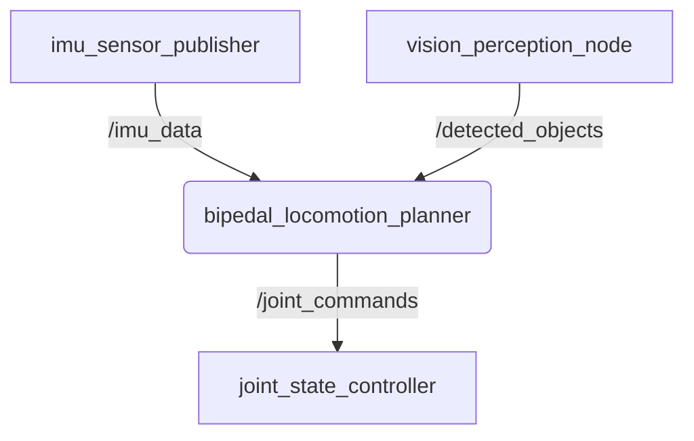

import Tabs from '@theme/Tabs';
import TabItem from '@theme/TabItem';

## Learning Objectives

Upon completing this chapter, you will be able to:

*   Articulate the role of ROS 2 as a foundational software framework in modern robotics, particularly for complex systems like humanoids.
*   Describe the core components of the ROS 2 architecture: nodes, topics, services, and actions.
*   Explain the publish-subscribe communication model and its application in robotic systems.
*   Differentiate between synchronous (service-based) and asynchronous (action-based) communication for robotic tasks.
*   Understand the function of the Unified Robot Description Format (URDF) in defining the physical structure and kinematics of a humanoid robot.
*   Relate ROS 2 concepts to the biological nervous system to form a strong conceptual model of a robot's software architecture.

## Introduction: A Nervous System for Robots

A humanoid robot is an intricate fusion of hardware—motors, sensors, processors, and a mechanical chassis. However, without a sophisticated software framework to orchestrate its components, this hardware is merely a marionette without a puppeteer. The Robot Operating System (ROS) provides this orchestration. ROS 2, its modern iteration, is not a traditional operating system like Windows or Linux; it is a flexible framework of software libraries and tools designed to simplify the creation of complex and robust robot behaviors (Macenski et al., 2022).

For a humanoid robot, the parallels between ROS 2 and a biological nervous system are striking. ROS 2 acts as the central and peripheral nervous system, managing the flow of information and commands. Sensory data from cameras (eyes), Inertial Measurement Units (IMUs) for balance (vestibular system), and joint encoders for proprioception (somatic senses) are transmitted across the system. In response, motor commands are dispatched to actuators in the limbs. This chapter explores the fundamental components of ROS 2 that enable this complex interplay, establishing it as the veritable nervous system for the next generation of humanoid robots.

## Nodes: The Brain's Functional Units

In the ROS 2 ecosystem, a **node** is the smallest unit of computation. Each node is a process responsible for a single, well-defined task. This modular approach is a cornerstone of ROS 2's design, promoting reusability and fault tolerance. If a node fails, it can be restarted without necessarily bringing down the entire robotic system.

For a humanoid robot, you might have nodes such as:
*   `bipedal_locomotion_planner`: A node that computes the gait and foot placements required to walk.
*   `imu_sensor_publisher`: A node dedicated to reading data from the IMU and publishing it for other parts of the system to use for maintaining balance.
*   `vision_perception_node`: A node that processes raw camera feeds to identify objects, obstacles, or people in the environment.
*   `joint_state_controller`: A node that commands the individual motors in the robot's joints (e.g., knees, elbows, fingers).

Each node is an independent executable that communicates with other nodes using the ROS 2 communication protocols.

*Figure 1: A simplified graph showing how different nodes in a humanoid might communicate.*

## Topics: The Sensory and Motor Pathways

If nodes are the functional units of the brain, **topics** are the neural pathways that carry information between them. Topics operate on a **publish-subscribe** model. A node can *publish* messages to a topic, and any number of other nodes can *subscribe* to that topic to receive those messages. This is an anonymous, asynchronous communication method; the publishing node does not know which nodes (if any) are subscribed.

This decoupling is essential for complex systems. For example, the `imu_sensor_publisher` node does not need to know about the locomotion planner or any other specific system that needs balance information. It simply publishes the robot's orientation and angular velocity to the `/imu/data` topic. Any node that needs this data can subscribe to it.

Key topics on a humanoid robot would include:
*   `/joint_states`: A topic where a node publishes the current angle, velocity, and effort of every joint, providing proprioceptive feedback.
*   `/scan`: Commonly used for LiDAR data to perceive the robot's immediate surroundings and avoid collisions.
*   `/cmd_vel`: A topic where a navigation or teleoperation node can publish velocity commands to make the robot move. For a humanoid, this might be interpreted by the locomotion planner to mean "walk forward at 0.5 m/s."

### Message Types
Every topic has a defined **message type**. This is the data structure for the information being sent. For example, the `/imu/data` topic might use the `sensor_msgs/Imu` message type, which has fields for orientation (as a quaternion), angular velocity, and linear acceleration. Using standardized message types ensures that nodes can correctly interpret the data being transmitted.

## Services: Direct Commands and Queries

While topics are excellent for continuous data streams, robotics often requires direct, two-way communication. This is handled by **services**. A service is defined by a request-and-response pair. A *client* node sends a request to a *server* node and waits for a response. This is a synchronous transaction—the client blocks until the server has completed the task and sent back a result.

Services are analogous to function calls. On a humanoid, a service might be used for tasks like:
*   `/set_gait_mode`: A service where a client can request the `bipedal_locomotion_planner` to switch from a walking gait to a jogging gait. The server would respond with a boolean indicating if the switch was successful.
*   `/get_kinematic_pose`: A client could request the forward kinematics for a specific limb (e.g., the right arm) given a set of joint angles. The server would perform the calculation and return the 3D pose of the end-effector.
*   `/calibrate_sensors`: A service to trigger a calibration routine for the robot's cameras or IMU.

## Actions: Complex, Goal-Oriented Tasks

Many robotic tasks are long-running and require feedback during execution. For example, telling a humanoid to "walk to the kitchen" is not instantaneous. The robot might take minutes to complete the task, and the requesting node might want updates on its progress or the ability to cancel the goal. This is where **actions** are used.

An action is composed of three parts:
1.  **Goal**: The request sent by an *action client* to an *action server* (e.g., "walk to coordinates X, Y").
2.  **Feedback**: The stream of updates the server provides to the client during execution (e.g., "current distance to target is 3.5 meters").
3.  **Result**: The final message sent by the server upon completion (e.g., "goal reached successfully").

Actions are asynchronous and non-blocking. A client can send a goal and then continue with other computations, processing the feedback as it arrives. It can also send a cancellation request at any time.

For a humanoid, actions are critical for high-level behaviors:
*   `FollowPath`: A navigation action to make the robot traverse a series of waypoints. Feedback would include its current position along the path.
*   `PickObject`: An action to command the robot to identify, approach, and grasp an object. Feedback might include the current state of the process (e.g., "approaching object," "opening gripper," "grasping").
*   `WaveHand`: A simple social interaction action.

## URDF: The Body Schema

The **Unified Robot Description Format (URDF)** is an XML file format used in ROS to describe all physical aspects of a robot. The URDF acts as the robot's *body schema*—its internal model of itself. This model is fundamental for a wide range of tasks, from simulation to motion planning.

A URDF file defines:
*   **Links**: The rigid components of the robot's body (e.g., torso, upper arm, forearm, palm). Each link has defined inertial properties (mass, moment of inertia) and visual/collision geometries.
*   **Joints**: The connections between links. Each joint defines the kinematics of how one link moves relative to another (e.g., revolute for an elbow, prismatic for a sliding component, or fixed for a rigid connection). Joints have defined axis of rotation and motion limits.
*   **Sensors and Actuators**: While not part of the core URDF specification, extensions like SDF (Simulation Description Format) or additional ROS plugins allow for the attachment of cameras, IMUs, and other sensors to the robot's links.

For a humanoid robot, the URDF is exceptionally complex, defining the dozens of degrees of freedom required for human-like motion. Software like RViz (ROS Visualization) can parse a URDF file to create a 3D visualization of the robot's model, and the MoveIt! motion planning framework uses it to compute collision-free trajectories for the robot's limbs.

## Conclusion

ROS 2 provides the essential software architecture for building sophisticated robots, and its concepts are particularly well-suited for the immense complexity of humanoids. By treating nodes as functional processing centers, topics as a distributed sensory-motor network, services as direct commands, actions as goal-oriented behaviors, and URDF as the underlying body model, we can construct a robotic nervous system. This modular, message-passing architecture not only facilitates development but also creates a resilient and scalable foundation upon which advanced capabilities like bipedal locomotion, manipulation, and human-robot interaction can be built.

## References

Macenski, S., Foote, T., Gerkey, B., Lalancette, C., & Woodall, W. (2022). Robot Operating System 2: Design, architecture, and uses in the wild. *Science Robotics, 7*(66), eabm6074. https://doi.org/10.1126/scirobotics.abm6074

Quigley, M., Conley, K., Gerkey, B., Faust, J., Foote, T., Leibs, J., ... & Ng, A. Y. (2009). ROS: an open-source Robot Operating System. *In ICRA workshop on open source software* (Vol. 3, No. 3.2, p. 5).
